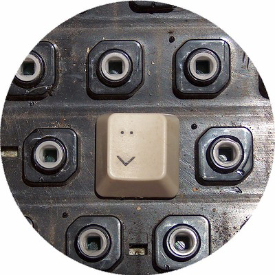

 combine into a smiley face" width="25%" height="25%" style="float:right;" />

# svelte-keystroke

A key-stroke observer for Svelte, focussed on simplicity

```html
<script>
  import Keystroke from "svelte-keystroke";
</script>

<Keystroke on:stroke={ ({ detail }) => console.log(detail) } />
```

Want to try it out real quick? Here's a [basic demo](https://svelte.dev/repl/16a2fa4f9ca14dcb98b0894f50598caf?version=3.41.0), and here's a busier, [comprehensive demo](https://svelte.dev/repl/83918eedc5df44a8814bb114c5716b06?version=3.41.0).

## Summary

_Keystroke_ offers four ways to respond to keyboard input, all through Svelte's `on:<foo>` events. The first three are pretty straightfoward.

- ① `on:stroke` Reports single, printable characters
- ② `on:combo` Only reports combinations involving modifier keys (Shift, Control, Alt, and Meta)
- ③ `on:heldKeys` For when you need raw details about which keys are currently depressed

The third option — let's call it "Binding Mode" lets you bind a function to whatever character you like.

- ③ `on:<key>` Runs the associated function every time the given key is pressed, regardless of its involvement as part of a stroke or combo

For examples, see `on:Enter`, `on:Escape`, `on:q`, & `on:Q` in the [comprehensive demo](https://svelte.dev/repl/83918eedc5df44a8814bb114c5716b06?version=3.41.0).

## Where's Meta / Command❓

> svelte-keystroke pauses whenever the Meta key (⌘ on macOS) is depressed.

This is intentional. Why?

Well, it [turns out](https://stackoverflow.com/a/27512489/230615) that the <a title="macOS Command">⌘</a> key — reported as "Meta" by keydown and keyup events, exibits some [funky behaviors](https://codepen.io/alexduloz/pen/nteqG), that make it rather torturous to work with. In this first release (and perhaps indefinitely), `svelte-keystroke` "handles" this weirdness by simply pausing operations until the ⌘/Meta key is lifted again.

## How is svelte-keystroke different?

### Built for svelte

As compared with [most js keystroke-handling libraries](#other-key-handling-libraries), `svelte-keystroke`'s most obvious feature is that it's a Svelte\* component.

> \*If you're not using Svelte, stop reading now and [go play for a few minutes!](https://svelte.dev/tutorial/basics).

### Comparison with `svelte-keydown`

`svelte-keystroke` owes its basic design to [`svelte-keydown`](https://github.com/metonym/svelte-keydown), and there's significant overlap between the two.

**Same**

- Arbitrary single-key binding via `on:<key>`…e.g., `on:Enter`, `on:Tab`

**Similar**

These events behave in similar ways, with the differences best observed by [experimenting in the REPL](https://svelte.dev/repl/a546827278fc4209a27262cc99b51315?version=3.42.1):

- key*down*: `on:key` ≈ key*stroke*: `on:stroke`
- key*down*: `on:combo` ≈ key*stroke*; `on:combo`

**Unique to `svelte-keystroke`**

- key*stroke*; `on:heldKeys`

## Brief History

> Why svelte-keystroke?<br><br> > _TL;DR — It does exactly what I need it to, no more, no less._

I was working on a Svelte app (link TBD) — a typing trainer, with the need to directly manage basic ASCII input (letters & basic punctuation), as well as keyboard combinations like _Control+R_. `svelte-keydown` seemed perfect at first, but there were subtle issues that made it unsuitable for my specific needs. (Don't ask what issues…I've since forgotten.) But it was close!

Luckily, `svelte-keydown` is simple enough that it was fairly trivial to create my own component and make it do exactly what I want. Now, as I prepare to for the first release of that typing app, I'm pausing to separate out this generic component. It works for me, but ymmv. Enjoy!

## Other Key Handling Libraries

### Svelte

- [svelte-keydown](https://github.com/metonym/svelte-keydown)

### JS

- [tinykeys](https://github.com/jamiebuilds/tinykeys)
- [hotkeys](https://github.com/jaywcjlove/hotkeys)
- [keymaster](https://github.com/madrobby/keymaster)
- [mousetrap](https://github.com/ccampbell/mousetrap)
- [clack](https://github.com/ulisesantana/clack)
- [keymage](https://github.com/piranha/keymage)
- [Keypress](https://github.com/dmauro/Keypress/)
- [KeyboardJS](https://github.com/RobertWHurst/KeyboardJS)

---

_Title image — "Alone on the keyboard" — slightly modified from [the original](https://www.flickr.com/photos/fdecomite/361512861/in/photostream/)_
